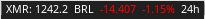

# cryptostatus-blocklet

Shows cryptocurrencies informations on the i3blocks for a given time period and currency using the rate.sx API. 

Blocklet basic display:


Where:
- COIN_SYMBOL   = Cryptocurrency code
- CURRENCY      = Currency code
- CURRENT_PRICE = End price for the period
- CHANGE_ABS    = Absolute change 
- CHANCE_PERC   = Percentual change 
- PERIOD        = Time period 


## Setup / Usage

Example i3blocks configuration:

```
[cryptostatus]
command=$SCRIPT_DIR/cryptostatus
interval=60
markup=pango
```

Edit the main script to change which currency, crypto and time period  

Example:

```
coin = 'eth'
currency = 'brl'
period = '24h'
```

## Dependencies

- python3


## Known Bugs

This script is just a prof of concept and for study purposes. It works but I know it's not the most efficient way to do this.


- Some currencies just brake the regex rules and don't work properly. As far as I tested BRL and USD works normaly, but EUR isn't recognized because of the
currency prefix. 


